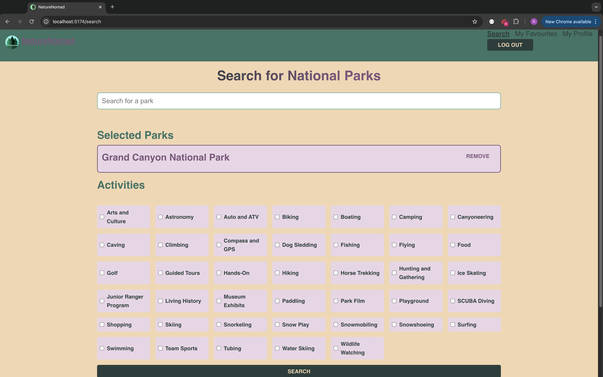

# NatureNomad

NatureNomad is a React-based web application that helps users discover and plan visits to national parks in the U.S.A. The app generates a customized top 10 list of parks based on user preferences, such as activities and park details. Users can save their favorite parks to a wishlist and revisit them later for further planning.

## Features

- Search for national parks by name or activity.
- Preselect up to 10 parks before generating the top 10 list.
- Save favorite parks to a wishlist.
- View detailed descriptions of parks, including activities and fees.
- User authentication for secure login and profile management.

---

## Screenshot

> Screenshot of the main search page where users can customize their park preferences.

---

## Requirements

Before you begin, ensure you have the following installed on your system:

- **Node.js** (version 16.x or higher)
- **npm** (comes bundled with Node.js)
- **Git** (for cloning the repository)
- A code editor (e.g., WebStorm, Visual Studio Code)

### API Keys

The application requires the following API key for the National Park Service:
VITE_API_KEY=VH0NU4pT0TJAlBErq2450GOdx2Rhf2gX3cQcJMM8

This key should be added to a `.env` file in the root directory of the project.

---

## Installation Instructions

Follow these steps to set up NatureNomad locally:

### 1. Clone the Repository
Use Git to clone the repository to your local machine:

git clone git@github.com:<your-username>/<repository-name>.git
cd <repository-folder>

### 2. Install Dependencies
Install all the required dependencies:
npm install: 
"axios": "^1.7.7",
"jwt-decode": "^4.0.0",
"lodash": "^4.17.21",
"lodash.debounce": "^4.0.8",
"react": "^18.2.0",
"react-dom": "^18.2.0",
"react-router-dom": "^6.26.2"

### 3. Set Up Environment Variables
Create a .env file in the root of the project:

Copy the contents of the .env.dist file into .env.
Add the following API key to the .env file:
VITE_API_KEY=VH0NU4pT0TJAlBErq2450GOdx2Rhf2gX3cQcJMM8

### 4. Run the Application
Start the development server
npm run dev

The app will run at http://localhost:5174 by default. Open this URL in your browser.

###  Login Credentials
To test the application, use the following demo account:

Gebruikersnaam: Pedrieto
Password: Pandabear
Available npm Commands

###  Here are the npm commands you can use during development:

npm run dev: Starts the development server for local testing.
npm run build: Builds the application for production deployment.
npm run preview: Previews the production build locally.
npm run lint: Checks the codebase for linting issues.
